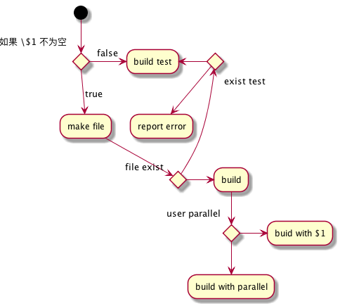

# haskellTest

* How to add package?
```
    edit bin path in .cabal/config
    cabal sandbox init
    cabal install moduleName
```

* Problem: cabal: /usr/bin/ar: permission denied
```
    Try https://github.com/haskell/cabal/issues/2653
```
## resources
* http://learnyouahaskell.com/starting-out#ready-set-go
* https://wiki.haskell.org/Haskell_in_5_steps
* http://dev.stephendiehl.com/hask/#basics

##Just for test 测试##

This expression $\sqrt{3x-1}+(1+x)^2$ is an example of a $\LaTeX$ inline equation.

he Lorenz Equations:

$$
\begin{aligned}
\dot{x} & = \sigma(y-x) \\
\dot{y} & = \rho x - y - xz \\
\dot{z} & = -\beta z + xy
\end{aligned}
$$


@startuml
(*) --> if "   如果 \$1 不为空" then
  -->[true] "make file"
  if "file exist" then
    -> "build" as ghc
  else
    if "exist test" then
      -left-> "build test"
    else
      --> "report error"
    endif
  endif
else
  ->[false] "build test"
endif
ghc --> if "user parallel" then
  --> "build with parallel"
else
  -> "buid with $1"
endif
@enduml




```bash
#!/bin/bash
if [ "$1" != "" ]; then
    if [ "$1" = "maths.hs" ]; then
        $GHC -O2 --make $1 -threaded -rtsopts -o "dest/$NAME"
    else
        $GHC --make $1 -o "dest/$NAME"
    fi
    rm -f "$NAME.hi"
    rm -f "$NAME.o"
else
    $GHC --make test.hs -o dest/test
    rm -f "test.hi"
    rm -f "test.o"
fi
```
